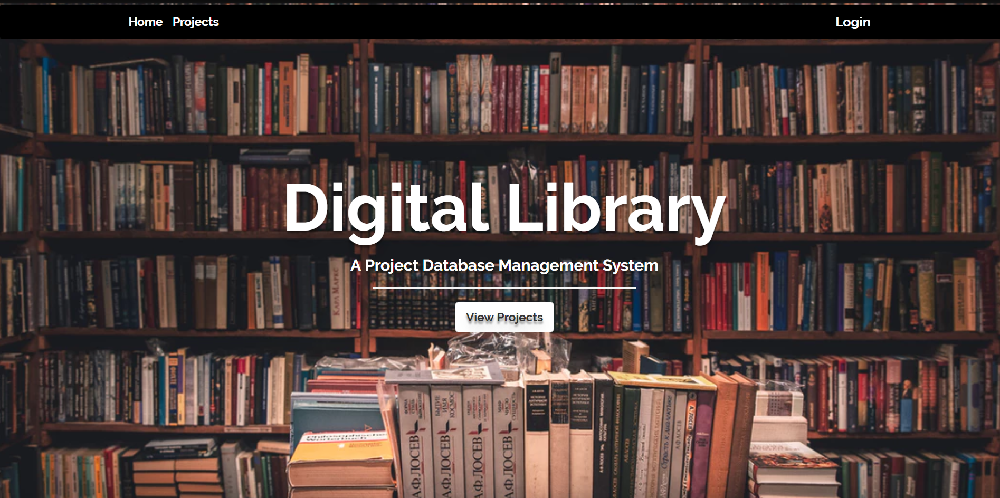

# Digitsl Library
Technology has become imperative in today’s day to day functioning of every possible
sector in the society. One of the key contributions of technology has been optimization of
human effort.
  The DIGITAL  LIBRARY (Project Database Management) project is particularly created to do so. It’s a
web app whose functioning is simple- Student creates project, and their respective
teachers would allocate marks to it, however it doesn’t end there. Any person, entering
the website, would be cited with projects created by students. Thus giving a simple glance
over what the project actually is and keeping track of student’s progress through marks,
grade and the projects itself.
  The Database System is well developed, simple and efficient. Thus making
retrieval and maintenance of the database easier.

https://digital-lib.herokuapp.com/

